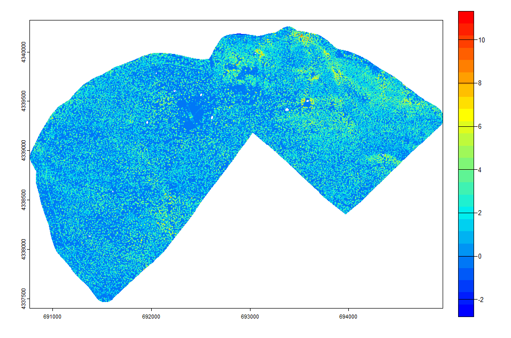
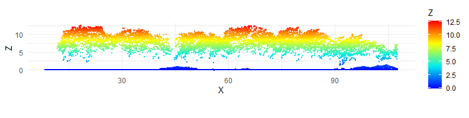
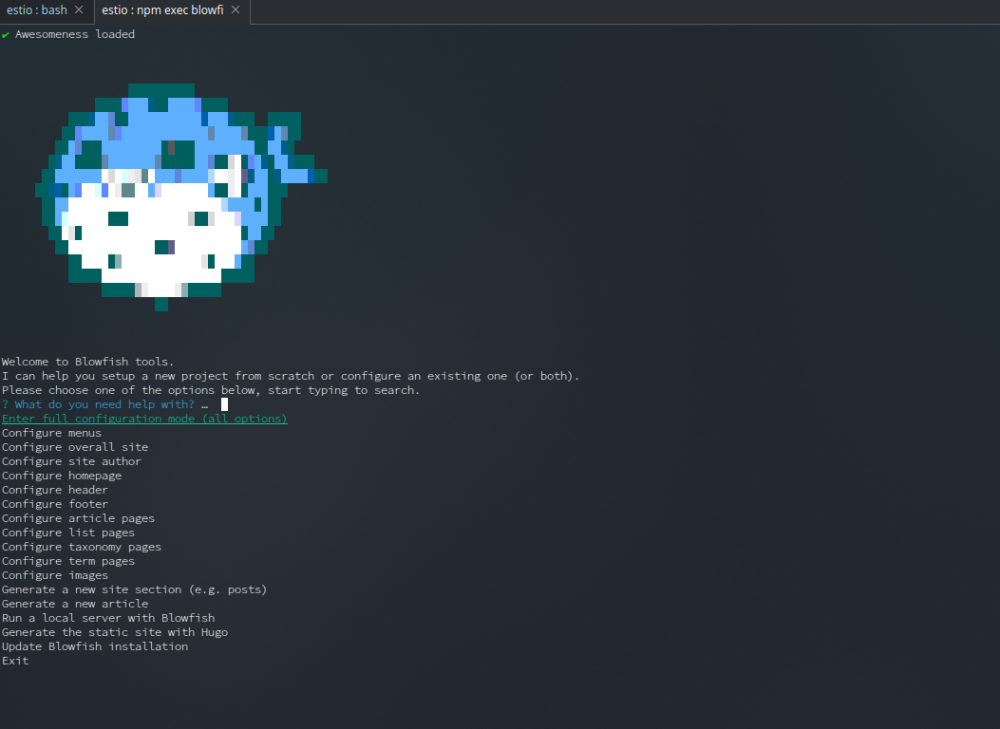

So, [Blowfish](https://blowfish.page/) hmmm!!! Why?



## Blowfish

Well it was quite a simple decision, after finding it, and it came down to some of the features, but mainly because:

* it looked good;
* markdown support;
* easily updatable;
* good looking;
* multi language;
* and it also looked good.

So by the end of last year and throughout the start of this one, I was wondering, *yeah, I'm kind of a overthinker or a late bloomer when it comes to execution cause I get tangled up in the thinking part*, about creating a new personal page / blog. At that time there was a lot going on with my life, and by a lot, I mean that I was thinking about leaving my daily work, focus only at the company that was in a new stage with a new foreign investor that joined us. So it was hectic and I thought...

***"I should write, it would allow me to concentrate on only one thing for a brief period of time of the day...write about what was happening and also exorcise it by putting it on something!"***

Seemed like a great plan, but did none of it.


## Alternatives
At the time, I was also messing a lot with LIDAR, trying to process point clouds, for forestry metrics and was using R for it.





So I stumble on [Quarto](https://quarto.org/), and it seemed really cool, lots of hype around it, seemed simpler than [blogdown](https://bookdown.org/yihui/blogdown/). So I dwelled a bit with it using [R-Studio](https://posit.co/products/open-source/rstudio/), but I didn't have the time to make it good looking.

Also looked at [Hugo](https://gohugo.io/), [Astro](https://astro.build/) and some other's. And it was when I looked at Hugo that I discovered Blowfish, created by a fellow portuguese, [Nuno Coração](https://n9o.xyz/about/). And it seemed right up my alley with the command line tools, *I have a soft spot for cli tools*, to ease the managing of it...

...😳😯😲😮😍 OMG it as 8-bit blowfish in the command line!!!



## So sort of quick how-to.

### Requirements
+ [node](https://nodejs.org/en)
+ [latest hugo](https://gohugo.io/installation/)
+ [git](https://git-scm.com/book/en/v2/Getting-Started-Installing-Git)

In case you are on fedora, like I'm, just do:
  ```bash
  sudo dnf install nodejs hugo git -y
  ```
This is one of the cool perks of Fedora, up to date packages. 

### Next...
...run this on your command-line
```bash
npx blowfish-tools
```

Select *"Setup a new website with Blowfish"*, and point to the folder you want. After that, you just start to configure it, just mess around, best way to learn is really trial and error. You can test and see the result of your experiences on the browser, by navigating to *localhost:1313*.

### Deploying it 

I used github, and to ensure it deploy correctly, created an action / workflow in the repo, like this one.

```yml
name: github pages

on:
  push:
    branches:
      - main  # Set a branch to deploy
  pull_request:

jobs:
  deploy:
    runs-on: ubuntu-22.04
    steps:
      - uses: actions/checkout@v3
        with:
          submodules: true  # Fetch Hugo themes (true OR recursive)
          fetch-depth: 0    # Fetch all history for .GitInfo and .Lastmod

      - name: Setup Hugo
        uses: peaceiris/actions-hugo@v2
        with:
          hugo-version: '0.136.5'
          extended: true

      - name: Build
        run: hugo --minify

      - name: Deploy
        uses: peaceiris/actions-gh-pages@v3
        if: github.ref == 'refs/heads/main'
        with:
          github_token: ${{ secrets.GITHUB_TOKEN }}
          publish_dir: ./public
```
## And that's that..

...and now I just need to worry about writing as often as I can and push the commit to github.


## Down the rabbit hole

Some useful links to get you started, if you need to know more or want to create your own page.

- https://n9o.xyz/posts/202310-blowfish-tutorial/
- https://blowfish.page/docs/
- https://blowfish.page/docs/configuration/
- https://blowfish.page/docs/shortcodes/
- https://blowfish.page/examples/
