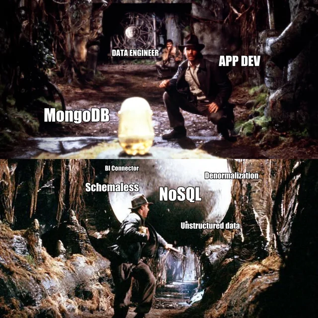
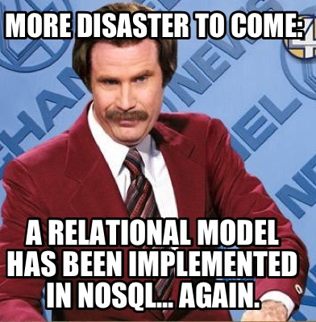

## Is normalization good?

Yes and no, it depends...

The normalization and harmonization of data is something I consider essential, it ensures that information can be read quickly... 

>*Although sometimes, when you come across data that's too structured, like, I don't know, [INSPIRE](https://knowledge-base.inspire.ec.europa.eu/index_en) :eyes:, you lose track of it, to the point where it seems complicated, just because needs to be*

...we have a better perception and clarity in the application or use of the information, but also a greater guarantee that the information is correct with its replication/propagation. Which is great, especially when we're dealing with information on land registry, or with land planning and management information, in the various types of Land Management Instruments (IGT) that exist in Portugal.

*- What about when it's not?* The normalization of ideologies and abject ideas is one of those cases, and then whoever holds power also tends to define what is “normal” and what is not, and we've all had History at school, or read or seen enough fiction to know what that leads to.

But back to data, they also say that the “denormalization” of data can be a good thing, especially when storage space is not an issue. This is because it allows the data to be read faster and better, and therefore with better performance, and even less overhead than a relational database server, especially when comparing ultra-normalized data.

But these memes exist...

or this one.

But sometimes it can make sense to use unstructured data, *perhaps* a subject for another post later on.

## The Norms

As I mentioned in a previous post, and I've also hinted in this one, part of my work is in land  planning / management. In this case, in order to develop land management instruments (IGT), the standards to be implemented would be:

+ [Data Model and Systematization of Graphic Information for Municipal Master Plans (PDM)](https://www.dgterritorio.gov.pt/sites/default/files/publicacoes/Modelodados_PDM_18022021_Vol1_e_Vol2.pdf);
  
+ [Technical Standard on the Production and Reproduction of National Ecological Reserve (REN) Delimitation Maps](https://www.dgterritorio.gov.pt/sites/default/files/publicacoes/NormasEspecificacoes_REN_08022020.pdf).

Both published in the Portugal's Official Law Gazette, in Aviso nº. 9282/2021 of May 17, as published here on the [Direção Geral do Território website](https://www.dgterritorio.gov.pt/Publicacao-de-normas-tecnicas).
In other words, some time has passed, which is great, because it allows us to see what the results have been, what difficulties they've encountered in implementing them and why they're not... :speak_no_evil: *almost spoiled the suspense*.

## The Objective

The idea, then, in this series of posts, is to focus on one of these standards, in this case, the National Ecological Reserve (REN) standard, and its implementation in FOSS4G technology[^1], while at the same time trying to comply with another legal standard, [National Digital Interoperability Regulation (RNID)](https://www.acessibilidade.gov.pt/publicacao/rnid-versao-2018-regulamento-nacional-de-interoperabilidade-digital/).

*- What about the PDM standard?* Let's take it easy, first the REN, and if it all goes well, why not. But a lot of people have been working on this for some time.



## The order of this blog series

As it's a rather boring subject, made up of a lot of annoyances, I'm going to put it in parts, and try to follow more or less this alignment:

1. Contextualize these IGTs and the current state and why of the standards;
2. We're going to have to take a look, at least once, at diagonally or scraping the surface, please bare with me. And their current implementation;
3. Make the symbology in the [QGIS] environment(https://qgis.org/);
4. Look at the [OGC Geopackage spec](https://www.geopackage.org/) and try to create the data model on it;
5. And in the end, wrap it all up as well as possible and make it available to everyone.

See you next time, for the second part.

[^1]: Free and Open Source Software for Geospatial
