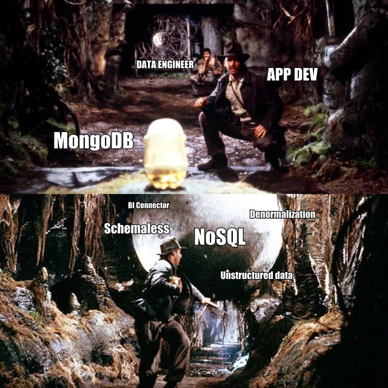

## Normalização é bom?

Sim e não, depende...

A normalização e harmonização de dados é algo que considero essencial, garante a rápida leitura da informação... 
> *Embora, às vezes, quando nos deparamos com dados demasiado estruturados, tipo sei lá, [INSPIRE](https://knowledge-base.inspire.ec.europa.eu/index_en) :eyes:, perde-se a
> noção, ao ponto de parecer complicado, só porque sim*

...temos uma melhor perceção e clareza na aplicação ou utilização da informação, mas também uma maior garantia da informação se encontrar correta com a sua replicação/propagação. O que é ótimo, especialmente quando estamos a lidar com informação sobre cadastro de propriedade, ou com informação de planeamento e gestão do território, nos diversos tipos de Instrumentos de Gestão de Território (IGT) que existem em Portugal.

*- Então, e quando não é?* A normalização de ideologias e de ideias abjetas é um desses casos, e depois quem detém o poder, tende também a definir o que é "normal" e o que não é, e todos nós já tivemos História na escola, ou lemos ou vimos ficção suficiente para saber ao que isso leva.

Mas voltando aos dados, também dizem que a "denormalização" destes pode ser algo bom, em especial quando gestão de espaço para armazenamento não é um problema. Isto porque permite uma melhor e mais rápida leitura dos dados, logo, uma melhor performance, e com isso até apresentar menos overhead, que um servidor de base de dados relacional, em especial quando comparados dados ultra normalizados.

Mas estes memes existem...

ou este.

Mas por vezes, pode fazer sentido a utilização de dados não estruturados, *quiçá* assunto para um outro post lá para frente.

## As Normas

Como referi num post anterior, e também já dei a entender neste, parte do meu trabalho é em ordenamento do território. Neste caso, para desenvolver os instrumentos de gestão do território (IGT), as normas a implementar seriam:

+  [Modelo de Dados e Sistematização da Informação Gráfica dos Planos Diretores Municipais (PDM)](https://www.dgterritorio.gov.pt/sites/default/files/publicacoes/Modelodados_PDM_18022021_Vol1_e_Vol2.pdf);
+  [Norma Técnica sobre a Produção e Reprodução das Cartas de Delimitação da Reserva Ecológica Nacional (REN)](https://www.dgterritorio.gov.pt/sites/default/files/publicacoes/NormasEspecificacoes_REN_08022020.pdf).

Ambas publicadas no Diário da República, no Aviso n.º 9282/2021 de 17 de maio, conforme publicitado aqui na página da [Direção Geral do Território](https://www.dgterritorio.gov.pt/Publicacao-de-normas-tecnicas). 

Ou seja, já passou algum tempo o que é ótimo, porque isso permite-nos ver quais os resultados, as dificuldades que se verificaram na implementação delas e porque é que não est... :speak_no_evil: *ia estragando o suspense*.

## O Objetivo

A ideia é então, nesta série de posts, debruçar-me sobre uma destas normas, neste caso, na norma da Reserva Ecológica Nacional (REN), e a sua implementação em tecnologia FOSS4G[^1], tentando ao mesmo tempo cumprir com outra norma legal, [Regulamento Nacional de Interoperabilidade Digital (RNID)](https://www.acessibilidade.gov.pt/publicacao/rnid-versao-2018-regulamento-nacional-de-interoperabilidade-digital/).

*- Então e a norma do PDM?* Vamos com calma, primeiro a REN, e caso corra bem, porque não. Mas já muita gente dedicou algum tempo a isso.



## A ordem desta blog series

Sendo um assunto um pouco chato, que é composto por um conjunto de chatices, vou colocá-lo em partes, e tentar seguir mais ou menos este alinhamento:

1. Contextualizar estes IGT e o estado atual e o porque das normas;
2. Vamos ter de olhar, pelo menos uma vez, nem que seja na diagonal ou raspão, e começar a sua atual implementação;
3. Fazer a simbologia em ambiente [QGIS](https://qgis.org/);
4. Olhar para o spec do [OGC Geopackage](https://www.geopackage.org/) e tentar criar o modelo de dados;
5. E no final, embrulhar, o melhor possível, e disponibilizar.

Até à próxima parte.

[^1]: Free and Open Source Software for Geospatial

