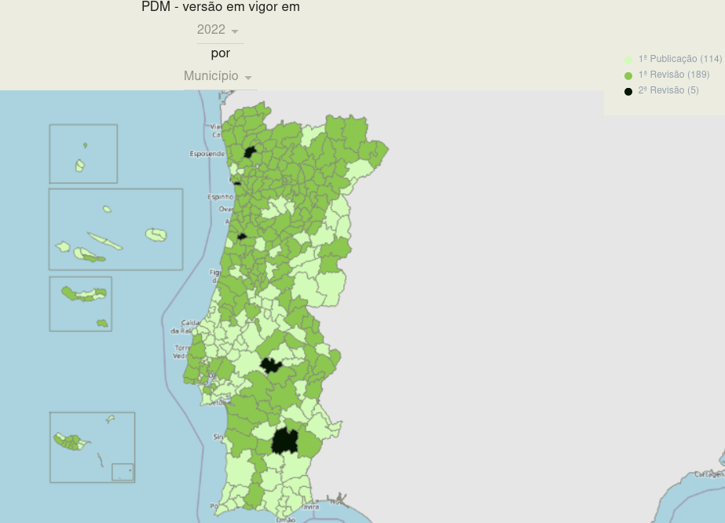
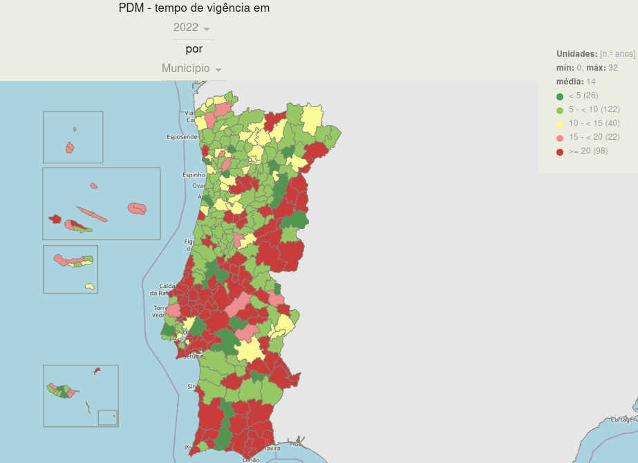

## Territorial Management Instruments (IGTs)

As mentioned in the previous post, territorial management instruments (we called them IGT) in Portugal are diverse, ranging from the well-known Plano Director Municipal (PDM), which are Municipal Master Plans, widely recognized by the general public. However, at a higher level, we other like the Special and Regional Plans, while at a lower level, there are plans with smaller territorial scope, such as Detailed Plans (PP) or Rural Space Intervention Plans (PIER).

Additionally, there are programs and/or strategies that bind the territory and population, which must therefore be incorporated into lower-level plans, such as PDMs. For instance, the cartography associated with integrated rural fire management, which must be integrated into various municipal IGTs.

Thus, it is indeed complex to gather a range of information from different scopes, from distinct entities, each with different objectives and sensitivities towards the same territory. Furthermore, we must comply with extensive legislation, which can sometimes be quite volatile. Added to this is the evolutionary dynamics of a territory, which may change due to major forces, such as fires, or human pressure.

> *Perhaps I'm oversimplifying, but the purpose of this blog series is not to philosophize about the state of IGTs, but simply to provide context and, in the end, try to implement the REN standard.*

This may explain the current situation in Portugal, as reflected in the data from the [REOT website for Municipal Master Plans](https://reot.dgterritorio.gov.pt/sistema-de-gestao-territorial/pdm).

As of 2022, all municipalities have published their PDMs.

However, in 2022, almost half (114) continue to manage territory based on the first version of the plan, and of these, 98 have a plan in force that is over 20 years old.

This means that most PDMs are still in the "paper" age and thus in a raster format, making it challenging to work with territory in 2024 using raster information produced in some cases almost 30 years ago...

>*as much as I love pixel art, it's a strange situation*

...this makes it challenging for the public to use.

Some examples.


But the preference for raster continues to this day, and no, I'm not joking. Recently approved plans and maps binding the territory and population are still in raster format. Although they are more readable, we still lack information beyond RGB or other color models. This happens because territorial planning continues to operate as if it were still in the "paper" era, and raster maps are essentially digital copies of paper maps.

## The Standard

Given this, standards become even more important as they allow, or at least should allow, us to move away from this outdated model focused on how the plan will look when printed. In essence, raster map production limits itself to this. We should only be concerned with the information since that is what truly binds the territory and population, not the color, line thickness, or pattern used in its representation.

*-So, how's the application going since 2021?* Yes, but before we get there, and since we'll only focus on REN, we first need to understand what REN is and how it is developed so that we can apply the standard. But I think I've given a few hints on how it's going!

### The REN

Let's use the official definition.

> The Reserva Ecológica Nacional (REN), which is the National Ecological Reserve is a biophysical structure comprising areas that, due to their sensitivity, ecological function and value, or exposure and susceptibility to natural risks, are subject to special protection.
>
> REN areas are subject to a public utility restriction regime that establishes a set of constraints on land occupation, use, and transformation, identifying compatible uses and actions for the regime's objectives across various area types.
>
> — <cite>National Territorial Commission (CNT)[^1]</cite>

In other words, it consists of a set of types of areas representing the elements described above. The REN is an essential a component of the Municipal Master Plans (PDM). And despite the term "National" in its name, REN is currently developed by municipalities, even though they do not approve it. Approval rests with two central administration entities with regional delegations.

Yes, it's a bit strange because, in my opinion, the opposite should happen, that is, REN should be produced regionally and then applied in each municipality. This would provide greater consistency and uniformity among municipalities in the same region and between regions. Additionally, some essential information for REN production might not exist or only partially exist in a municipality, such as soil maps or geological cartography.

> yeah, we're a bit behind!

But also to avoid things like this. Currently the state needs to buy information from itself to produce information demanded by the state, to be delivered to the state itself.

But I digress. So as mention, approval depends on regional delegations, which makes standards and guidelines even more crucial. Yet, each delegation has its interpretation not only of how to obtain the types of areas composing REN but also of how to represent them. For example, in one region, a one-hectare of cartographic generalization may be allowed to ensure less noise and more compact REN patches, but in another region, the allowance can be three hectares.

> And to better understand this, I’ll try to be as brief as possible. The REN methodology changed in 2012, more then 10 years ago, with [Portaria n.º 419/2012, of December 20](https://files.diariodarepublica.pt/1s/2012/12/24600/0720307212.pdf). At that time, only one region implemented these methodologies, while most others refrained, considering the 2012 approved methods required testing and clarification. Many municipalities took the opportunity to review their PDMs to avoid waiting for years to approve RENs according to the new methodology. However, clarification arrived late, which likely led to biases in REN modeling up to that point.
> 
> For instance, clarification on one type of area, erosion, only appeared in 2020 with [this document](https://cnt.dgterritorio.gov.pt/sites/default/files/Guia_Apoio_Calculo_LS.pdf), which, incidentally, assumes that the modeling occurs in proprietary software (but that's another rant for another time), and also with the 2019 revision of the 2012 legislation with [Portaria n.º 336/2019, of September 26](http://cnt.dgterritorio.gov.pt/sites/default/files/Portaria_336_2019.pdf).
>
> Even after the publication of the LS calculation support guide for erosion, one region considered the guide’s method for calculating accumulated flows as poor practice.

All this to say that application of the standard it's also difficult, because of divergent interpretations or distinct regional adjustments, which we’ll explore in the next part of the series when we take a closer look at the standard.

I said this would be tedious, but it’s important to understand that reviewing a territorial management plan, while municipal in nature, depends on the nuances and subjectivities of each approving entity.

[^1]: Taken from the website [https://cnt.dgterritorio.gov.pt/ren-pagina](https://cnt.dgterritorio.gov.pt/ren-pagina)
