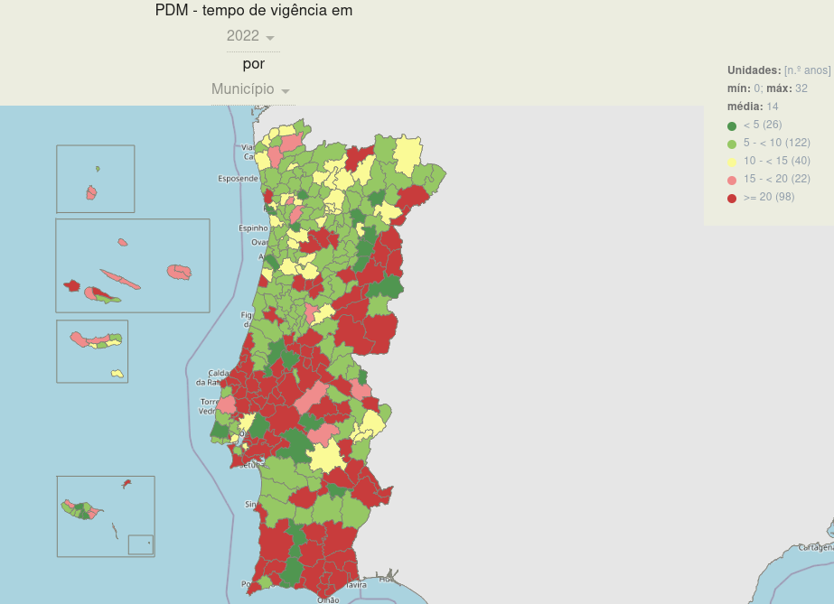

## Os IGTs

Como referi no post anterior, os instrumentos de gestão do território (IGT) em Portugal podem ser variados, desde dos mais famosos como os Planos Directores Municipais, os quais são do conhecimento da generalidade da população. Mas num nível superior a esses, temos os Planos Especiais e Planos Regionais, e já num plano inferior temos planos com uma área territorial mais pequena, como os Planos de Pormenor (PP), ou Planos de Intervenção em Espaço Rural (PIER).

Para além destes, temos ainda os programas e/ou estratégias que vinculam o território e a população, e por conseguinte terão de ser vertidos para os planos de nível inferior, como os PDM. A título de exemplo a cartografia de âmbito da gestão integrada de fogos rurais, que tem de ser incorporada, e bem, nos diversos IGT de âmbito municipal.

Por isso, sim, é complexo conseguir reunir uma panóplia de informação de diferentes âmbitos, de entidades distintas e onde cada uma tem objetivos e sensibilidades diferentes para o mesmo pedaço de território. Além disso, temos de cumprir com muita legislação, sendo que esta por vezes é também bastante volátil. A isto acresce a dinâmica evolutiva que um território pode ter, seja por motivos de força maior, como incêndios, ou por pressão humana.

> *Talvez, esteja a resumir demasiado, mas o objetivo desta série de post, não é filosofar sobre o estado dos IGT, mas só contextualizar e no final tentar implementar a norma da REN.*

Tudo isto talvez explique então a situação atual, que temos hoje em Portugal, e segundo os dados do [website do REOT para os Planos Directores Municipais](https://reot.dgterritorio.gov.pt/sistema-de-gestao-territorial/pdm).

Até 2022, todos os municípios, têm o seu PDM com publicado.

Contudo, em 2022, quase metade (114) continua a gerir o território com base na 1ª versão do plano, e desses, 98, têm um plano em efetividade com mais de 20 anos.

Isto significa que a maioria dos PDM, ainda se encontram na época do "papel", e por conseguinte em formato raster, e trabalhar o território em 2024 com informação raster produzida, em alguns casos, à quase 30 anos...

>*e por mais que eu goste pixel art, é uma situação estranha!*

...torna a sua utilização difícil pela população.

Alguns exemplos.


Mas a adoração pelo raster, continua nos dias de hoje, e não, não estou a brincar. Nos planos aprovados recentemente, as cartas que vinculam o território e a população continuam a ser no formato raster. Mas vá, são mais legíveis, mas continuamos a não ter informação para além do RGB, ou outro modelo de cores. E isto ocorre porque, o planeamento e ordenamento do território continua a trabalhar como se ainda estivesse na era do "papel" e as plantas raster são no fundo, isso, cópias digitais das plantas em “papel”.

## A Norma

E face a isto as normas ganham ainda mais importância, estas permitem ou pelos deveriam permitir o abandono deste modelo obsoleto de nos preocupar como o plano ficará impresso, isto porque a produção da planta raster acaba no fundo, por se cingir a isso. E nós só deveríamos estar preocupados com a informação já que é isso que realmente vincula o território e a população e não é a cor, a espessura de linha ou a trama utilizada na sua representação.

*-Então como corre a aplicação delas, desde 2021?* Sim, mas antes de irmos aí e porque só nos vamos focar na REN, temos primeiro de entender o que é a REN e como a mesma é elaborada para no final aplicarmos a norma. Mas acho que já dei algumas pistas de como corre!

### A REN

Vamos usar a definição oficial.

>A Reserva Ecológica Nacional (REN) é uma estrutura biofísica que integra o conjunto das áreas que pela sensibilidade, função e valor ecológicos ou pela exposição e suscetibilidade perante riscos naturais, são objeto de proteção especial.
>
>As áreas REN são sujeitas a um regime de restrição de utilidade pública que estabelece um conjunto de condicionamentos à ocupação, uso e transformação do solo, identificando os usos e as ações compatíveis com os objetivos desse regime nos vários tipos de áreas.
>
> — <cite>Comissão Nacional do Território (CNT)[^1]</cite>

Ou seja, é composta por um conjunto de tipologias, que representam o que está descrito acima. E a REN é um elemento essencial dos Planos Diretor Municipal (PDM). Mas apesar de ter no nome Nacional, quem as elabora atualmente, são os municípios, apesar de não serem estes quem as aprova. São sim, duas entidades da administração central, com delegações regionais.

Sim, é um pouco estranho isto porque o que deveria ocorrer, na minha opinião, deveria ser o inverso, ou seja, regionalmente a REN deveria ser produzida e só depois vertida em cada município. Isto permitiria uma garantia maior de uniformidade e consistência entre os municípios da mesma região, mas também entre as regiões. Até porque parte da informação essencial para a produção da REN, pode não existir num município ou só existir parcialmente, como é caso das cartas de solo, ou da cartografia geológica, entre outras.

E também para evitar isto, porque para garantir a elaboração da REN, temos o estado, a adquirir informação ao próprio estado, para produzir e entregar essa mesma informação ao estado.

Mas estou a divagar.

A aprovação então depende das delegações regionais, o que torna a norma e orientações ainda mais importantes, mas o que temos é que cada delegação tem a sua própria interpretação não só da forma como são obtidas as tipologias que compõem a REN, mas também como são representadas. A título de exemplo, numa região a generalização cartográfica permitida, de modo a garantir menos ruído e mais compacidade das manchas de REN, de uma tipologia é de 1 hectare, contudo noutra região já de 3 hectares.

> E para entenderem melhor e tentarei ser o mais sintético possível. A metodologia da REN, mudou em 2012, à mais de 10 anos, com a [Portaria n.º 419/2012, de 20 de dezembro](https://files.diariodarepublica.pt/1s/2012/12/24600/0720307212.pdf) mas nessa altura só uma região quis logo implementar essas metodologias, todas ou quase todas as outras, não impuseram isso, porque consideraram que as metodologias aprovadas em 2012 careciam de testes e clarificação. Muitos municípios aproveitaram para rever os seus PDM por forma a não ter os problemas ou a esperar anos a fio, para conseguirem aprovar as REN segundo a nova metodologia. Contudo, essa clarificação chegou tarde, o que com certeza pode ter originado enviesamentos na modelação das REN até lá.
> 
> Por exemplo, a clarificação de uma das tipologias, a erosão, só surgiu com a publicação em 2020 deste [documento](https://cnt.dgterritorio.gov.pt/sites/default/files/Guia_Apoio_Calculo_LS.pdf), que já agora de agnóstico não tem nada, porque explica e assume que a modelação terá de ser feita em software proprietário (mas isto é um rant que fica para outra altura), mas também com a revisão da legislação de 2012, em 2019 com a [Portaria n.º 336/2019, de 26 de setembro](http://cnt.dgterritorio.gov.pt/sites/default/files/Portaria_336_2019.pdf).
>
> E mesmo após a publicação do guia de apoio ao cálculo do LS para a tipologia da erosão, uma das regiões decidiu considerar como má prática a forma como o cálculo dos fluxos acumulados eram realizados no guia.

Isto tudo para dizer o que!! Que também na aplicação da norma, temos leituras divergentes ou ajustes interpretativos distintos de região para região, que veremos na próxima parte da série quando analisarmos melhor a norma.

Eu disse que iria ser chato, mas é importante entender que revisão de um plano de ordenamento de território, que embora seja de cariz municipal, depende das vicissitudes ou subjetividades de cada uma das entidades que aprovam esses planos.

[^1]: Retirado do site [https://cnt.dgterritorio.gov.pt/ren-pagina.](https://cnt.dgterritorio.gov.pt/ren-pagina)

