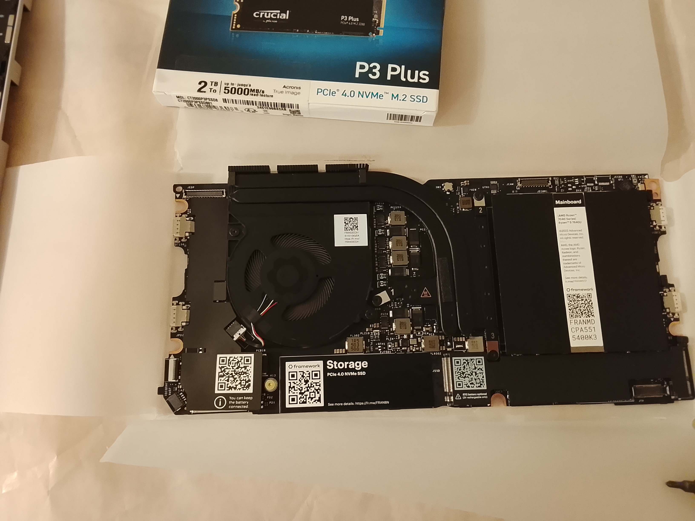
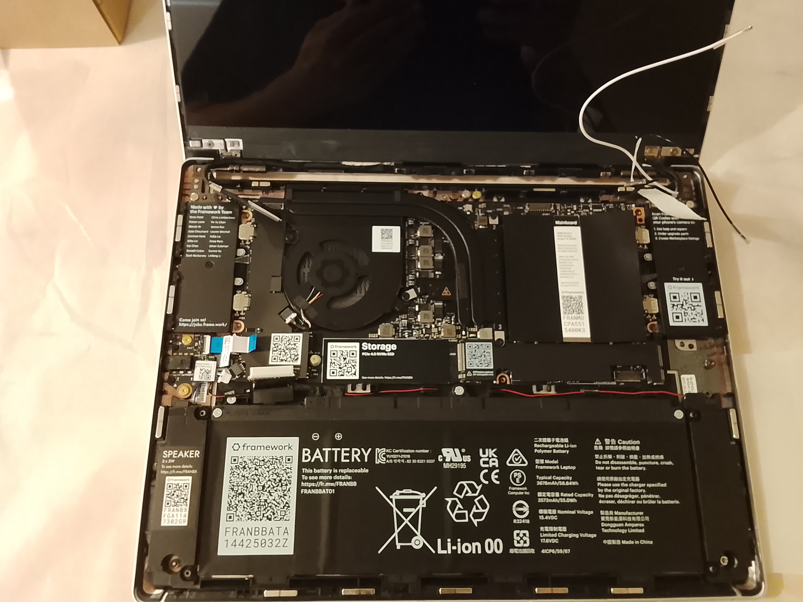
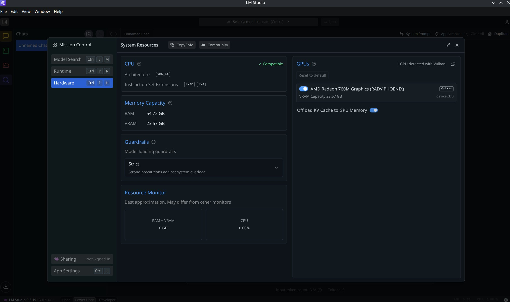

# So it's been a while...well more than while!

But a lot has happen since november, still a father of none but I went through some sort of a divorce, with the selling of my share in my old company in past May which I founded in 2012. It was sad but a relief form a chaotic and neurotic 2024, but that's all other story to share about that experience.

I didn't start anything new in the meantime, apart from some new side projects, small and to get the mind busy and uncomfortable as one should - like this was and I failed to maintain it - where one of those projects surely does make me more uncomfortable than I should be, do to it's scale, but LFG!

But again, that's for a whole new batch of posts, cause I need something to write about, and also finish the DeNorm series.

So this brings me to today's post!!

## The framework 13

So by selling my part in company, I needed to buy a new laptop, cause my old Dell was a company propriety. So I thought it was the right time to buy one, a new one I mean.

The last new laptop I bought, was my MacBook Pro in 2008, which had one of those faulty Nvidia GPUs, which I didn't know until it died, and to my surprise it died 3 months after the extended warranty expired, and for the logic board repair, they quoted me at the time over 600€ in 2013, that I just refused to pay.

After this I went full-on to linux on refurbished laptops, just having two since then via the company.

And along comes [Framework](https://frame.work/pt/en) with their products and approach, and it was right at my alley. "Simple", "yours" and repairable.

So it seemed to be the right time for me to go with the framework 13 laptop version, and went almost fully DIY. Well I cheated a bit, cause I bought the chassis kit, that it comes almost assembled and with most of the parts, missing 'just' the mainboard, Wi-Fi adapter, RAM, and storage. Almost like buying a pre-assembled IKEA where you just tighten the loose screws.

For the mainboard I went with the AMD Ryzen 5 7640U, cause the the Ryzen AI 5 340 doesn't seem to be what it should, performance-wise and the AMD Ryzen 7 7840U was not available for shipping. I would prefer the AMD Ryzen AI 9 HX 370, but that's on whole new ballpark when it comes to price. Added to the mainboard I went with 64 Gb of RAM, and a 2Tb NVMe.

Here are some pictures of the assembly.

Adding the Wifi adapter was the only thing that actually made me sweat a bit.

But what made me really sweat was the first boot. Why? Because it just showed a black screen. It seemed on, but nothing happened! So I plugged it into the power socket and forced a reset, and still a black screen but with a little more brightness...by now the sweat just poured...

After a few seconds that felt like minutes, the BIOS posted.

## The distro and the experience

With that tragedy averted, I installed Fedora 42 Kinoite, which went flawlessly, everything just worked as it should, even sleep mode (Linux folks will understand) on the 1st boot it even asked me to configure the fingerprint sensor that works as expected. Although I disable it (but just in the CLI), cause the sudo commands would default to the fingerprint instead of the password.

After some fussing about, I installed some apps, like VSCodium, KeePassXC, Bottles, etc...I rebooted and went to the BIOS to explore.

On the BIOS, I expected to have more control over it, like giving the APU more memory - it seems to be capped at the 4Gb or it allocates that as a baseline and it increases on demand, it's not clear - hence the 64 RAM install. But aside from that, a really simple and straightforward BIOS but an older version, after checking that there's an [update of the BIOS](https://knowledgebase.frame.work/en_us/framework-laptop-13-bios-and-driver-releases-amd-ryzen-7040-series-r1rXGVL16S). And, ohhh boy, it baffles me how LVFS isn't a mainstream thing - or it is and I've been living under a rock? Just copy paste 3 commands to the terminal, wait for a while...and BOOM, it's done, BIOS updated, still no update on the RAM to GPU, but LMStudio shows some promising VRAM, need to test it though. 

I've been using the laptop for almost a month now, and it's lovely, really pleased with the overall experience, it really has a good balance being performant enough without compromise... well, almost, because there's a not-so-great part, more below. I really love the screen and I really like the keyboard.

## The Good, the bad and the wonderful

I'm not a reviewer, nor is this a review for the framework 13 laptop, just my actual experience with it.

And I just love it, it's small, robust and it just works, as it should with no need for any extra meddling, apart from the assembly. And it's just awesome how it doesn't look like a computer partially assembled at home. 

And that is one of the things that's it's very remarkable to me, it really is. It's a laptop made with love, care, ingenuity with reparability in mind without lacking in quality or design, where I just tighten some screws and it works like any other laptop from any other company, but it's not like the others! Almost looks like an Apple product but at the same time is so far from being an Apple product, and I think this is one of the best compliments I can give to the framework team.

Now, the bad, or the not-so-great part. The AMD WI-FI adapter, which seems to be a rebrand of a MediaTek chip, has a really, really bad signal range. The speed is good, but the range is bad. As I still have a bit of a gamer in me and also often have to run complex GIS operations or mess with point clouds, it handles everything really well, even AAA games with more than acceptable _frames per second_. But it's noisy, noisier than I thought, although it never seems to thermal throttle or lose its footing while playing or running GIS operations. Other than that, it's very quiet. The battery life is also not fantastic, around 4 hours, but that's acceptable for me.

But the wonderful part, even about the bad or not-so-great bits, is that I can just buy a different Wi-Fi adapter and replace it, like the AX210, which seems to solve the range issue. The noisy part can probably be mitigated a little with a PTM sheet, which I'll probably do in the future. Or I can just buy a new mainboard and use this one as a homelab / media hub. For the battery, I have to explore the configuration for [TuneD](https://docs.redhat.com/en/documentation/red_hat_enterprise_linux/8/html/monitoring_and_managing_system_status_and_performance/getting-started-with-tuned_monitoring-and-managing-system-status-and-performance). But it feels like mine, right from the get-go. It gives me more leeway as an owner because its boundaries are wider than all the other solutions on the market.

And this to me is the key point in the framework experience, not just the environmental or the reparability aspect of it, which is great on its own, but it comes as tax when buying. But a tax I will gladly pay for, because it gives me a whole new range of possibilities as the owner of the product, that other brands seem to afraid to give or just don't care, even if you pay a premium price.

See you soon.

