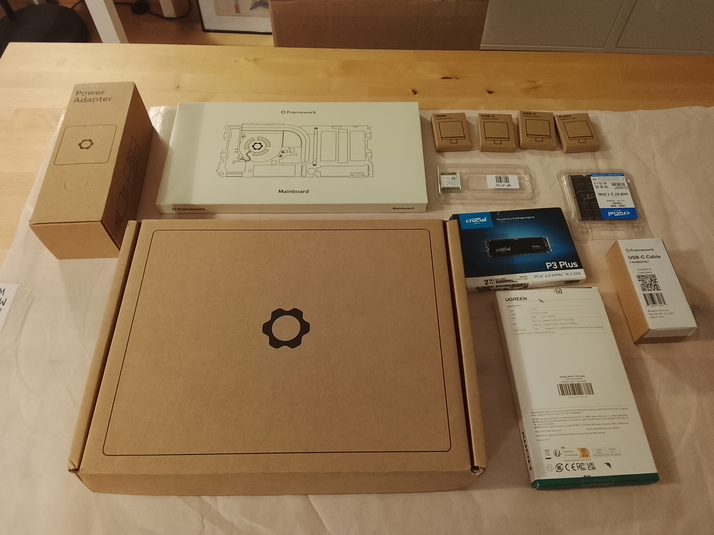
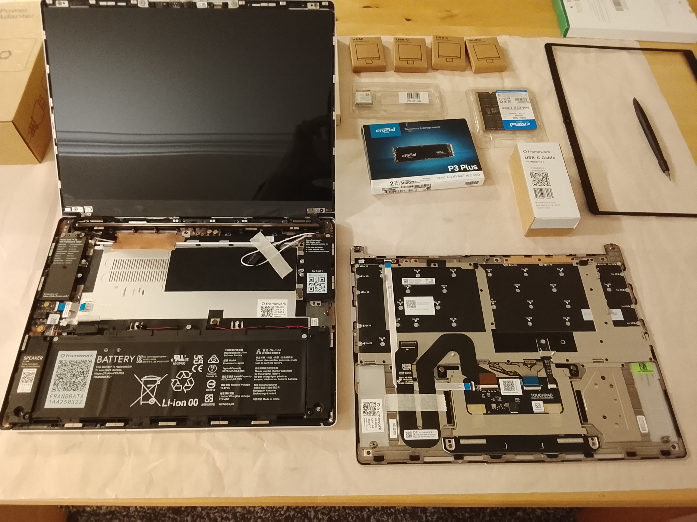
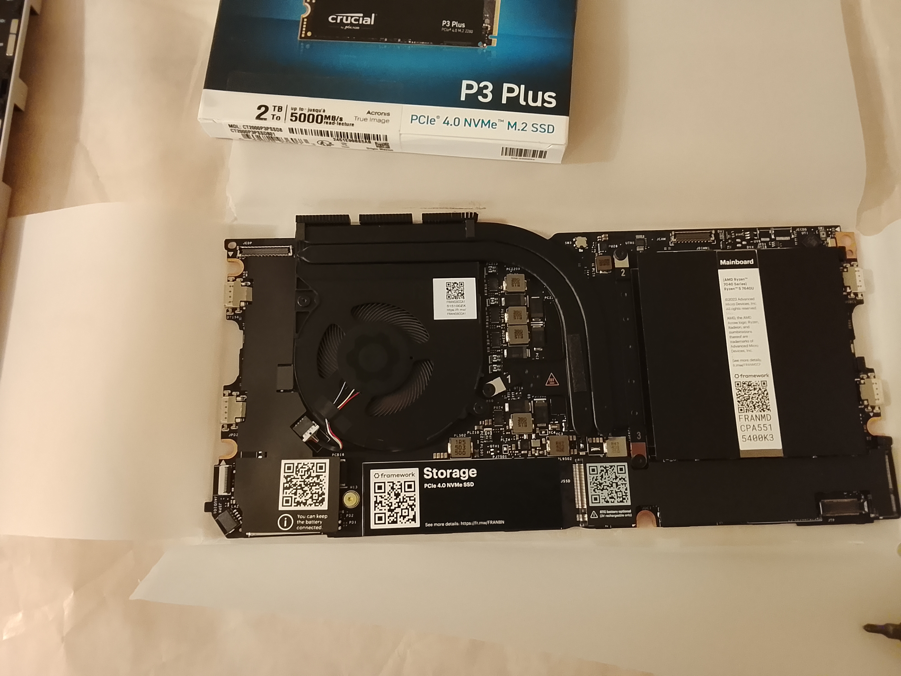
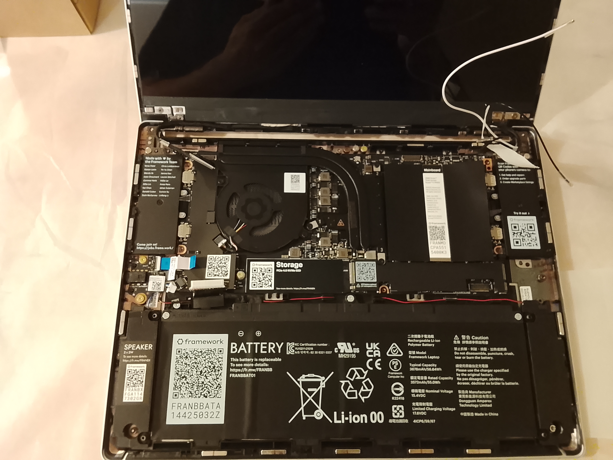
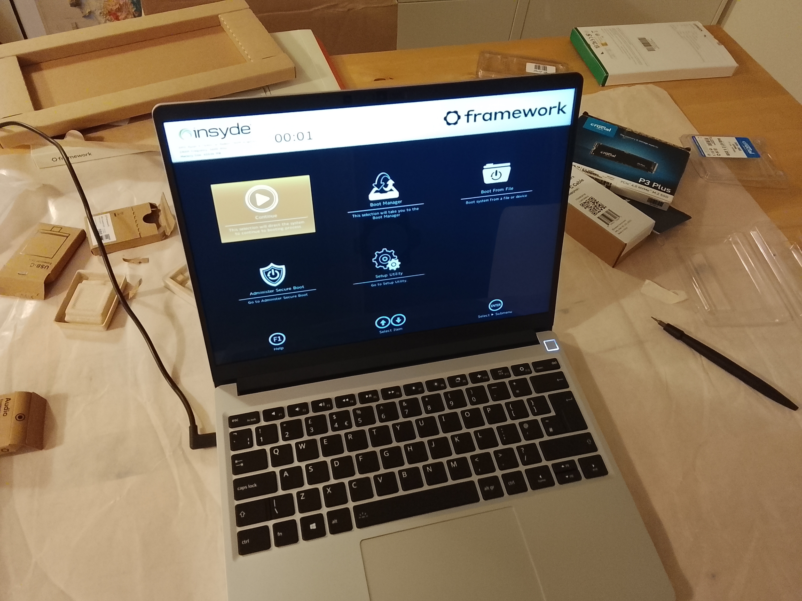
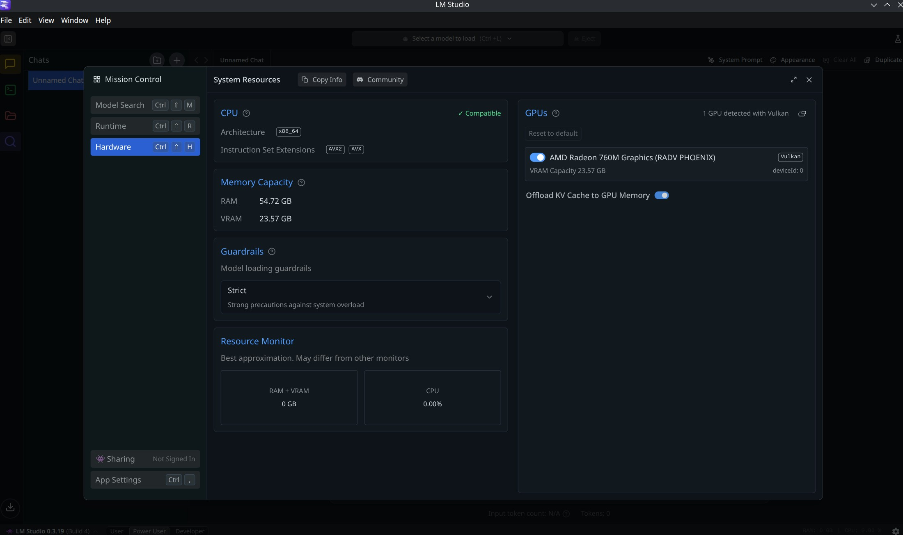

# Então, já passou algum tempo... bem, mais do que algum tempo!

Mas muita coisa aconteceu desde novembro. Continuo pai de nenhum, mas passei por uma espécie de divórcio, com a venda da minha parte na minha antiga empresa que fundei em 2012, em maio passado. Foi triste, mas também um alívio após um 2024 caótico e neurótico, mas isso é uma outra história para partilhar.

Não comecei nada de novo entretanto, à parte de alguns novos projetos paralelos, mas pequenos para manter a mente ocupada e a sentir-se desconfortável, como deve ser – tal como este blog era ser, e que eu não consegui manter. Um desses projetos está certamente a deixar-me mais desconfortável do que deveria, devido à sua escala, mas LFG!

Mas, mais uma vez, isso fica para uma nova leva de posts, porque preciso de assunto para continuar a escrever, e também de terminar a série DeNorm.

O que me traz ao post de hoje!!

## O Framework 13

Ao vender a minha parte na empresa, precisei de comprar um portátil novo, porque o meu antigo Dell era propriedade da empresa. Então, achei que era a altura certa para comprar um, um novo, quero dizer.

O último portátil novo que comprei foi o meu MacBook Pro em 2008, que tinha uma daquelas GPUs Nvidia defeituosas. Que só descobri quando ele morreu e, para minha surpresa, morreu 3 meses depois de a garantia alargada expirar. Para a reparação da *logic board*, pediram-me na altura mais de 600€ em 2013, que eu simplesmente recusei a pagar.

Depois disto, passei a usar exclusivamente Linux em portáteis recondicionados, tendo tido apenas dois desde então, através da empresa.

E eis que surge a [Framework](https://frame.work/pt/en) com os seus produtos e abordagem, e era mesmo a minha praia. "Simples", "teu" e "reparável".

Pareceu-me a altura certa para optar pelo Framework 13, e fui quase totalmente em modo DIY. Bem quase, fiz batota, porque comprei o kit do chassi, que vem montado e com a maioria das peças, faltando "apenas" a *mainboard*, o adaptador Wi-Fi, a RAM e o armazenamento. Quase como comprar um móvel do IKEA pré-montado onde só tens de apertar os parafusos soltos.

Para a *mainboard*, escolhi o AMD Ryzen 5 7640U, porque o Ryzen AI 5 340 não parece ser o que devia, em termos de desempenho, e o AMD Ryzen 7 7840U não estava disponível para envio. Teria preferido o AMD Ryzen AI 9 HX 370, mas isso já seria noutra liga no que toca ao preço. Para acompanhar a *mainboard*, optei por 64 GB de RAM e um NVMe de 2 TB.

Aqui ficam algumas fotos da montagem.

Adicionar o adaptador Wi-Fi foi a única coisa que realmente me fez suar um bocado.

Mas o que me fez suar a sério foi o primeiro arranque. Porquê? Porque apareceu um ecrã preto. Parecia ligado, mas nada! Liguei-o à tomada e forcei um reinício. Continuava um ecrã preto, mas com um pouco mais de brilho... nesta altura, o suor já escorria em bica...

Após alguns segundos, que pareceram minutos, a BIOS lá apareceu.

## A distro e a experiência

Com essa tragédia evitada, instalei o Fedora 42 Kinoite, que funcionou na perfeição. Tudo funcionou como devia, até o sleep / suspensão (a malta do Linux vai perceber). No primeiro arranque, até me pediu para configurar o sensor de impressão digital, que funciona como esperado. No entanto, desativei-o (apenas na CLI), porque os comandos *sudo* passavam a pedir a impressão digital em vez da password.

Depois de alguma "bricolage", instalei algumas aplicações, como o VSCodium, KeePassXC, Bottles, etc... Reiniciei e fui à BIOS para explorar.

Na BIOS, esperava ter mais controlo, como dar mais memória à APU – parece estar limitada a 4 GB, ou aloca isso como base e aumenta conforme a necessidade; não é claro – daí a instalação de 64 GB de RAM. Mas, tirando isso, é uma BIOS muito simples e direta, embora numa versão mais antiga. Então, depois de verificar, vi que havia uma [atualização da BIOS](https://knowledgebase.frame.work/en_us/framework-laptop-13-bios-and-driver-releases-amd-ryzen-7040-series-r1rXGVL16S). E, caramba, faz-me uma confusão como o LVFS não é algo *mainstream* – ou é, e eu tenho andado a viver debaixo de uma pedra?. Copiar e colar 3 comandos no terminal, esperar um bocado... e BOOM, está feito! A BIOS está atualizada. Continua sem novidades na RAM para a APU, mas o LMStudio mostra uma VRAM promissora. Tenho de testar, no entanto.

Estou a usar o portátil há quase um mês e é uma maravilha. Estou muito satisfeito com a experiência geral, tem um bom equilíbrio, sendo suficientemente performante sem compromissos... bem, quase, porque há uma parte menos boa, mais abaixo. Adoro o ecrã e gosto muito do teclado.

## O Bom, o Mau e o Maravilhoso

Não sou um *reviewer*, nem isto é uma análise ao Framework 13, apenas a minha experiência real com ele.

E eu simplesmente adoro-o. É pequeno, robusto e simplesmente funciona, como devia, sem necessidade de grandes invenções, para além da montagem. E é incrível como não parece um computador parcialmente montado em casa.

E isso é uma das coisas que para mim é notável. É mesmo. É um portátil feito com amor, cuidado e engenho, com a reparabilidade em mente, sem faltar na qualidade ou no design. Eu só apertei uns parafusos e ele funciona como qualquer outro portátil de qualquer outra empresa, mas não é como os outros! Quase parece um produto da Apple, mas ao mesmo tempo está tão longe de o ser, e acho que este é um dos melhores elogios que posso dar à equipa da Framework.

Agora, o mau, ou a parte menos boa. O adaptador WI-FI da AMD, que parece ser um *rebrand* de um chip da MediaTek, tem um signal range muito, muito mau. A velocidade é boa, mas o alcance é mau. E como ainda tenho um pouco de *gamer* em mim e muitas vezes também tenho de correr operações GIS complexas ou brinco com nuvens de pontos. Ele aguenta-se muito bem com tudo, até com jogos AAA com *frames por segundo* mais do que aceitáveis. Mas é barulhento, mais do que eu pensava, embora nunca pareça entrar em *thermal throttle*, ou perder o pé a jogar ou a correr operações SIG. Fora isso, é muito silencioso. A bateria também não é fantástica, cerca de 4 horas, mas é aceitável para mim.

Mas o maravilhoso, mesmo nas partes más ou menos boas, é que posso simplesmente comprar um adaptador Wi-Fi diferente e substituí-lo, como o AX210, que parece resolver o problema do alcance. A parte do barulho provavelmente pode ser um pouco mitigada com uma folha PTM, o que provavelmente farei no futuro. Ou posso simplesmente comprar uma nova *mainboard* e usar esta como um *homelab* / *media hub*. Da bateria tenho de explorar a configuração do [TuneD.](https://docs.redhat.com/en/documentation/red_hat_enterprise_linux/8/html/monitoring_and_managing_system_status_and_performance/getting-started-with-tuned_monitoring-and-managing-system-status-and-performance=) Mas sinto que é meu, desde o início. Dá-me mais margem de manobra como dono, porque as suas fronteiras são mais largas do que todas as outras soluções no mercado.

E este, para mim, é o ponto-chave da experiência Framework. Não é apenas o aspeto ambiental ou da reparabilidade, que por si só já é ótimo, mas que vem como um "imposto" na compra. Mas é um imposto que pago de bom grado, porque me dá toda uma nova gama de possibilidades como dono do produto, possibilidades que outras marcas parecem ter demasiado medo de dar ou simplesmente não se importam, mesmo que se pague um preço *premium*.

Até breve.